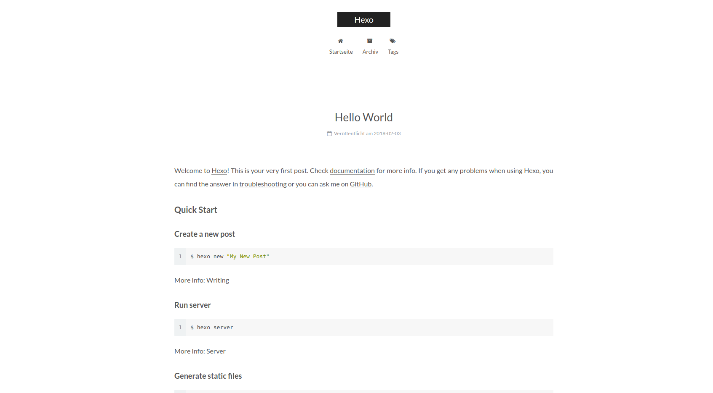

## 安装Hexo
```
npm install -g hexo-cli
```
如果还没有安装npm，需要先安装nodejs，npm
## 初始化Hexo项目
```
hexo init ./textBlog
```
此命令会初始化Hexo项目需要的文件
## 安装npm包
```
cd textBlog
npm install
```
## 生成html文件
```
hexo g
```
## 本地发布
```
hexo s
```
此时，可以在浏览器中访问<http://localhost:9001>,就会看到默认生成的一篇blog了

